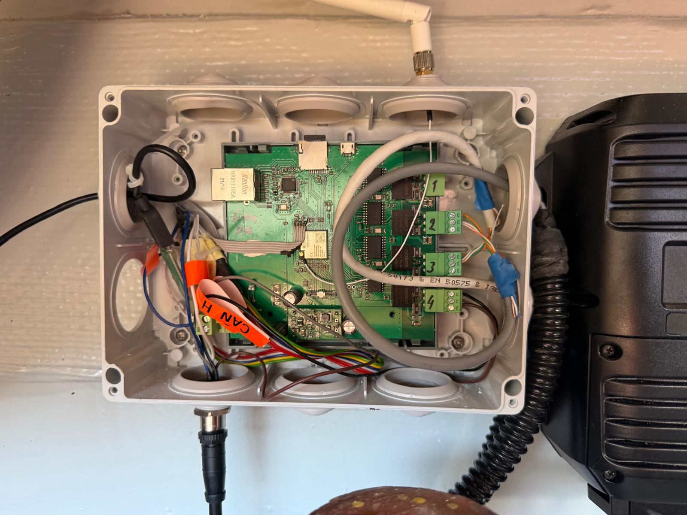
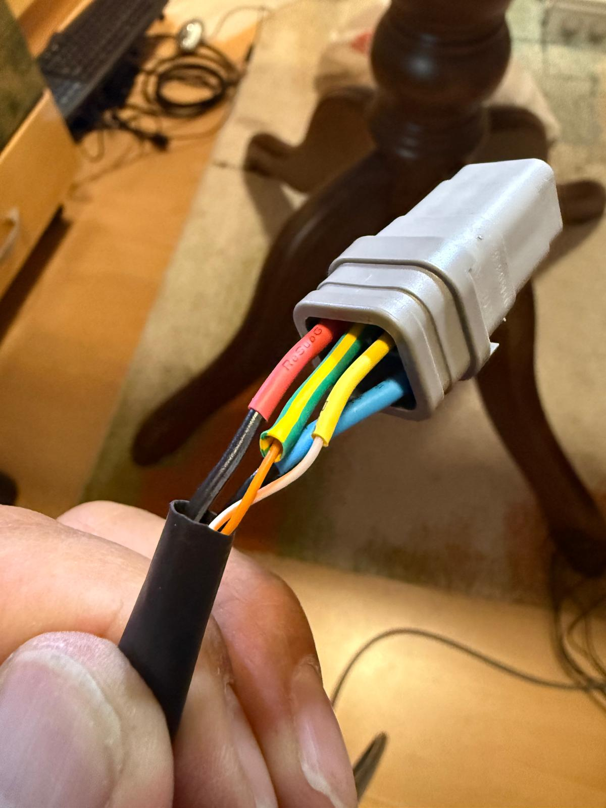
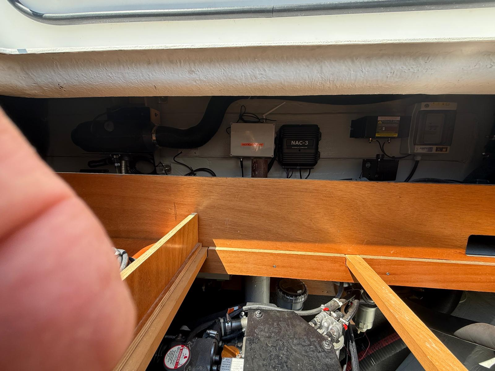

# Soulmate — On-Board Electronics Technical Manual

**Vessel:** Lagoon 450 "Soulmate"  
**Document:** Simplified technical overview for service technicians  
**Version:** 1.0 — July 2026  
**Language:** English

---

## Overview — What Is Installed

Three custom electronic devices have been added to the vessel alongside the existing B&G Zeus3S chartplotter and Yanmar engine ECUs. Together they provide:

- **Engine data on the chartplotter** — RPM, coolant temperature, oil pressure, fuel flow, battery voltage, engine hours displayed on Zeus3S
- **Remote monitoring** — all vessel data visible in real time from anywhere via mobile internet (LTE) and a secure VPN tunnel
- **Local web dashboard** — any phone or tablet on board can view all instrument data in a browser without internet
- **Engine data logging** — every engine run automatically saved to SD card (CSV format) for maintenance records

---

## Installed Devices

### 1. Yacht4CAN — Engine Gateway

**Function:** Reads Yanmar engine data (J1939 CAN bus) and converts it to NMEA 2000, so the B&G Zeus3S chartplotter can display engine information.

**Connections:**
- **CAN2** → Starboard (STBD) engine — yellow/green cable, Deutsch 6-pin DT connector
- **CAN3** → Port engine — yellow/green cable, Deutsch 6-pin DT connector
- **CAN4** → NMEA 2000 backbone — white Micro-C connector to Simnet
- **Power:** 12V + GND, max 0.35A
- **USB-C** → firmware updates only (not needed in normal operation)

**Indicator:** LED on board blinks during normal operation.

**Data logged:** every engine session saved to SD card as `/j1939_NNN.csv` (rotates at 50 MB, max 100 files ≈ ~250 hours of engine data).

> ⚠️ **Do not disconnect CAN cables while engines are running.**





---

### 2. Yacht4Mon — NMEA 2000 Monitor

**Function:** Listens to the NMEA 2000 network and publishes all instrument data (navigation, wind, depth, engines, attitude) to a local web page and to a remote Grafana dashboard via LTE.

**Connections:**
- **NMEA 2000** → backbone via Micro-C connector (listen-only — does not transmit anything to the network)
- **Power:** 12V from NMEA 2000 DeviceNet connector (red/black) OR separate 12V supply

**Web dashboard (local):** Open a browser on any device connected to the boat WiFi:
```
http://192.168.100.3
```
Displays: position, SOG, COG, heading, STW, log, wind (apparent + true), depth, heel, trim, sea temperature, engine data, battery status. Auto-refreshes every 2 seconds.



---

### 3. RUTX11 — LTE Router

**Function:** Provides boat WiFi network, LTE mobile internet, and a secure VPN tunnel to the owner's server for remote monitoring.

**SIM card slots:**
- **SIM 2** (bottom slot) — owner's data SIM, always present, always active as fallback
- **SIM 1** (top slot) — guest/skipper SIM; when inserted, all internet traffic routes through it automatically. When removed, system falls back to SIM 2 within ~90 seconds.

**WiFi networks:**
- SSID: `RUT_SOUL_5G` — visible network for skippers, guests and technicians
- SSID: `RUT_SOUL_2G` — hidden, for instruments only (Yacht4CAN, Yacht4Mon)
- Password for `RUT_SOUL_5G`: *(provided separately by owner)*

**Router admin access:**
- URL: `http://192.168.100.1` (from boat LAN)
- Admin credentials: *(provided separately by owner)*
- Read-only account: username `skiper` *(password provided separately)*

---

## Network Overview

```
NMEA 2000 backbone (250 kbps)
  ├── B&G Zeus3S chartplotter  (displays engine data from Yacht4CAN)
  ├── Yacht4CAN  (CAN4 output → backbone)      IP: 192.168.100.2
  ├── Yacht4Mon  (listen-only)                 IP: 192.168.100.3
  └── other instruments (depth, wind, GPS, heel...)

Boat WiFi LAN  192.168.100.0/24
  ├── RUTX11 router / gateway                  IP: 192.168.100.1
  ├── Yacht4CAN                                IP: 192.168.100.2
  └── Yacht4Mon                                IP: 192.168.100.3

LTE → WireGuard VPN → Owner's server (remote Grafana dashboard)
```

---

## How to Access Data

### From on board (any phone/tablet on boat WiFi)

| What | Address | Notes |
|------|---------|-------|
| All instrument data | `http://192.168.100.3` | Yacht4Mon dashboard, auto-refresh 2s |
| Engine gateway status | `http://192.168.100.2` | Yacht4CAN dashboard, engine data + SD log list |
| Download engine logs | `http://192.168.100.2` → Logs tab | CSV files, one per session |
| Router status | `http://192.168.100.1` | RUTX11 admin (read-only: user `skiper`) |

### Remotely (owner only, via VPN)

The owner can access all dashboards from anywhere in the world using the VPN connection. The remote Grafana dashboard shows historical data with graphs.

---

## Normal Operation — What to Expect

**At engine start:**
- Yacht4CAN detects J1939 frames within ~5 seconds
- Zeus3S engine page shows live RPM, temperature, oil pressure
- Yacht4Mon web dashboard shows engine data within ~10 seconds
- SD card logging starts automatically

**At anchor / engines off:**
- Yacht4Mon continues to show navigation data (GPS, wind, depth) as long as NMEA 2000 instruments are powered
- Remote monitoring continues as long as RUTX11 has LTE signal

**Power cycle / reboot:**
- Yacht4CAN and Yacht4Mon boot in ~10–15 seconds and connect to WiFi automatically
- No manual intervention required after power restoration

---

## Indicator Summary

| Device | Indicator | Normal | Problem |
|--------|-----------|--------|---------|
| Yacht4CAN | Board LED | Blinking | Not blinking = no power or firmware crash |
| Yacht4Mon | Board LED | Blinking | Not blinking = no power or firmware crash |
| RUTX11 | Front panel LEDs | Signal bars lit, WiFi LED on | No signal = SIM or antenna issue |
| Yacht4Mon dashboard | Engine RPM | Shows value or `---` | `---` = no J1939 data from Yacht4CAN |
| Yacht4Mon dashboard | nav/wind/depth | Shows values | `---` = NMEA 2000 instrument not sending |

---

## Basic Troubleshooting

### Zeus3S does not show engine data

1. Check Yacht4CAN is powered (LED blinking)
2. Check CAN2/CAN3 cables connected to engines — Deutsch connectors seated firmly
3. Check NMEA 2000 backbone cable from Yacht4CAN CAN4 output
4. Open `http://192.168.100.2` — if Engine 0/1 show `rx=0`, CAN cables may be swapped or termination resistors missing

### Web dashboard shows `---` for all values

1. Check Yacht4Mon is powered
2. Check boat WiFi — are you connected to `RUT_SOUL_5G`?
3. Try `http://192.168.100.3` — if page doesn't load, Yacht4Mon has no IP (WiFi issue)
4. NMEA 2000 network must be powered for instrument data to appear

### No LTE / no remote access

1. Check SIM card is seated in SIM 2 slot of RUTX11
2. Check RUTX11 LTE antenna connected
3. Open `http://192.168.100.1` → Network → Mobile → check signal strength
4. If SIM 1 is inserted (guest SIM) and has no signal, remove it — system falls back to SIM 2 within 90 s

### Engine data logging — SD card full or missing

- SD card is inside Yacht4CAN enclosure
- Format: FAT32, MBR partition (not GUID/GPT)
- Old logs are deleted automatically when 100 files reached
- To download logs without removing SD: `http://192.168.100.2` → Logs tab → Download

---

## Do Not Touch

| Item | Reason |
|------|--------|
| RUTX11 GTK rekey setting (must stay 65535) | Lower value causes ESP32 devices to disconnect every 10 minutes |
| WireGuard VPN configuration on RUTX11 | Changing keys disconnects remote monitoring |
| 120 Ω termination resistors on CAN terminals | Without them Yacht4CAN receives 0 frames even with correct wiring |
| Yacht4CAN/Yacht4Mon firmware via USB | Owner only — requires specific build environment |
| NMEA 2000 network wiring while instruments are on | Standard marine electronics safety |

---

## Configuration Files (owner reference)

**Yacht4CAN** — `/config.json` on SD card:
```json
{
  "ssid": "RUT_SOUL_2G",
  "ip": "192.168.100.2",
  "engines": 2,
  "engine0_can": 2,
  "engine1_can": 3
}
```

**Yacht4Mon** — stored in device flash (LittleFS), updated via USB by owner.

---

## Contact

For technical questions about this installation:

**Owner:** *(name)*  
**Telegram:** `@__________________`  
**Email:** *(email)*

---

*This document describes a custom DIY installation. No commercial warranty is implied.*

*[← Back to README](../README.md)*
